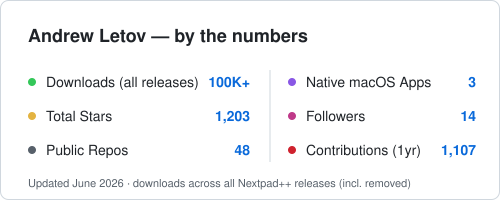

# Hi, I'm Andrew.

**macOS-native app developer** | **Creator of Nextpad++ for Mac** | **Notepad++ → macOS**

Currently geeking out in open source software projects, working on agents and building fast, native Mac apps.

## Start Here

-  **[Nextpad++](https://nextpad.org/)** (100K+ downloads) — the first full native macOS port of Notepad++
-  **[NextZip](https://nextpad.org/#nextzip)** — native 7-Zip-style archiver and WinZip alternative for Mac
-  **[Beads Viewer](https://nextpad.org/#beads)** — native issue & task tracker for multi-agent AI systems

### GitHub
-  **[Nextpad++](https://github.com/nextpad-plus-plus/nextpad-plus-plus-macos)** — native Notepad++ port: Scintilla engine, 80+ languages, plugins, Universal Binary, signed & notarized
-  **[NextZip](https://github.com/nextpad-plus-plus-plugins/NextZip.macos)** — 7-Zip-powered archive manager for macOS (ZIP, 7z, TAR…)
-  **[Beads Viewer](https://github.com/nextpad-plus-plus/NppBeads)** — view, edit and sync Beads JSONL files and Dolt databases for multi-agent AI

### Plugins Ecosystem
-  **[Plugin List](https://github.com/nextpad-plus-plus/nppPluginList)** — the macOS plugin registry for Nextpad++

## Stats

<picture>
  <source media="(prefers-color-scheme: dark)" srcset="github-stats-dark.svg" />
  
</picture>

## Find me

